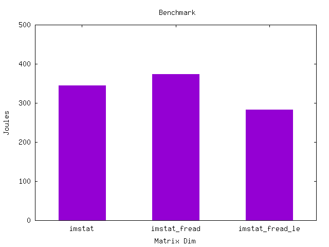

# FITS Endian Case Study

This is case study is to see the impact of the endianess of data stored in FITS on the energy consumption when reading the file

**Scenarios**

1. imstat: Read fits with cfitsio calculate min, max, mean
2. imstat_fread: Read fits headers with cfitsio, read file with fread, calculate min, max, mean
3. imstat_fread_le: Read fits headers with cfitsio, read file with fread without swapping endian, calculate min, max, mean. This method assumes the file is in little endian format

imcvt_big_to_little: Utility to convert FITS from big endian to little endian

## Performance

### Ryzen 3700X

